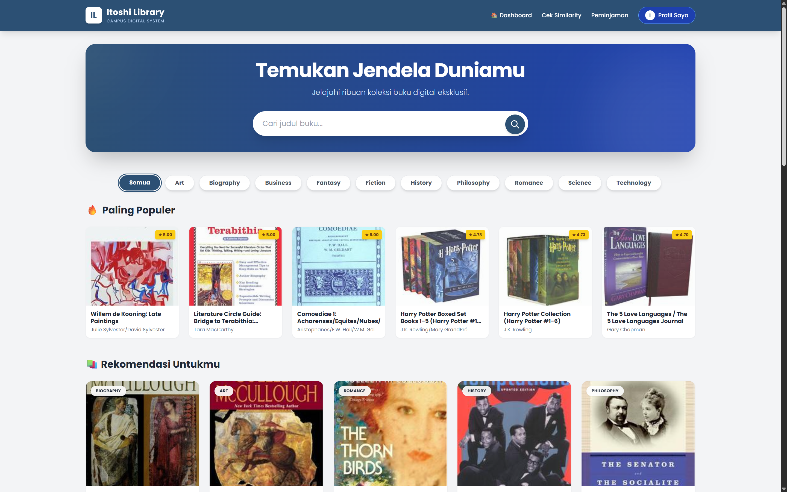
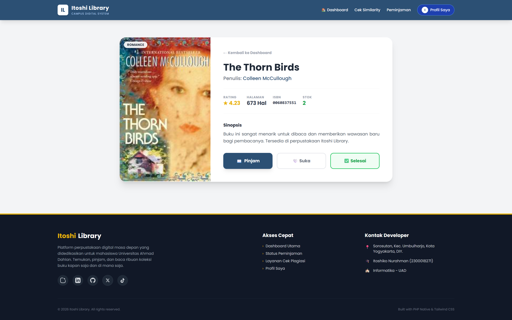

# 📚 Itoshi Library - Digital Library Management System


**Itoshi Library** adalah sebuah Sistem Informasi Perpustakaan Digital berbasis web yang dirancang untuk mempermudah manajemen sirkulasi buku, anggota, dan pelaporan. Proyek ini dikembangkan menggunakan pendekatan **Native PHP** dengan arsitektur yang bersih, aman, dan performa tinggi.

Project ini disusun untuk memenuhi tugas akhir **Responsi Praktikum Pemrograman Web Dinamis** di Universitas Ahmad Dahlan.

---

## 📸 Preview Aplikasi

<p align="center">
  
  
</p>

> *Catatan: Tampilan antarmuka didesain modern dan responsif menggunakan Tailwind CSS.*

---

## 🛠️ Technology Stack

Proyek ini dibangun menggunakan teknologi berikut untuk memastikan stabilitas dan kemudahan pengembangan:

### **Backend (Server-Side)**
* **Language:** [PHP Native (Pure PHP)](https://www.php.net/) - Tanpa Framework backend.
* **Database Driver:** PDO (PHP Data Objects) untuk keamanan transaksi database.
* **Architecture:** Model-View-Controller (MVC) *Simplified Pattern*.
* **Security:** `password_hash` (Bcrypt), Prepared Statements, Session Management.

### **Frontend (Client-Side)**
* **Styling:** [Tailwind CSS](https://tailwindcss.com/) (via CDN) - Utility-first CSS framework.
* **Markup:** HTML5 Semantic.
* **Scripting:** Vanilla JavaScript (untuk interaksi UI sederhana).

### **Database & Tools**
* **RDBMS:** MySQL / MariaDB.
* **Server:** Apache (via XAMPP/Laragon).
* **Version Control:** Git & GitHub.
* **URL Rewriting:** Apache `.htaccess` module.

---

## 🔥 Fitur Utama (Key Features)

### 1. 📚 Manajemen Koleksi (Book Management)
* **CRUD Operasi:** Tambah, Baca, Ubah, dan Hapus data buku.
* **Bulk Import:** Fitur import data buku massal via file `.csv`.
* **Stock Control:** Otomatisasi pengurangan stok saat dipinjam.

### 2. 🔄 Sirkulasi & Transaksi
* **Peminjaman:** Validasi stok dan pencatatan tanggal pinjam.
* **Pengembalian:** Update status dan restock otomatis.
* **Riwayat:** Log aktivitas peminjaman per user.

### 3. ⭐ Fitur Unik (Exclusive)
* **Similarity Check Service:** Modul simulasi cek plagiasi (Turnitin-style) untuk mahasiswa.
* **Interactive Tracker:** Fitur *Mark as Favorite* dan *Mark as Read*.
* **Smart Search:** Pencarian buku berdasarkan judul, penulis, atau kategori.

### 4. 🖨️ Reporting (Pelaporan)
* **Direct Print Mode:** Halaman khusus cetak tanpa elemen navigasi.
* Laporan Koleksi Buku.
* Laporan Transaksi Peminjaman.
* Laporan Aktivitas Similarity.

---

## ⚙️ Persyaratan Sistem (Prerequisites)

Sebelum menjalankan aplikasi, pastikan komputer Anda memiliki:

* **PHP:** Versi 8.0 atau lebih baru.
* **Web Server:** Apache (Disarankan menggunakan XAMPP atau Laragon).
* **Database:** MySQL.
* **Browser:** Google Chrome / Edge / Firefox (Terbaru).
* **Internet:** Diperlukan untuk memuat *Tailwind CSS CDN*.

---

## 🚀 Cara Instalasi (Installation)

1.  **Clone Repository**
    ```bash
    git clone [https://github.com/itoshiko-nurahman/itoshi-library.git](https://github.com/itoshiko-nurahman/itoshi-library.git)
    ```

2.  **Setup Database**
    * Buka **phpMyAdmin** (biasanya di `http://localhost/phpmyadmin`).
    * Buat database baru dengan nama `library_db`.
    * Import file `library_db.sql` yang terdapat di root folder project.

3.  **Konfigurasi Project**
    * Pastikan folder project berada di dalam direktori `htdocs` (jika XAMPP) atau `www` (jika Laragon).
    * Periksa konfigurasi database di `config/db.php`:
        ```php
        $host = 'localhost';
        $db   = 'library_db';
        $user = 'root';
        $pass = ''; // Sesuaikan jika ada password
        ```

4.  **Jalankan Aplikasi**
    * Buka browser dan akses: `http://localhost/itoshi-library`
    * Register New User
    * Login

---

## 📂 Struktur Folder

```bash
itoshi-library/
├── actions/       # Handler untuk logika form (Controller)
├── assets/        # Gambar dan resource statis
├── auth/          # Halaman autentikasi
├── config/        # Konfigurasi database
├── includes/      # Header, Footer, Navbar
├── pages/         # Halaman antarmuka utama
├── uploads/       # Direktori penyimpanan file user
├── index.php      # Dashboard utama
└── library_db.sql # File backup database
